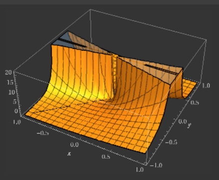
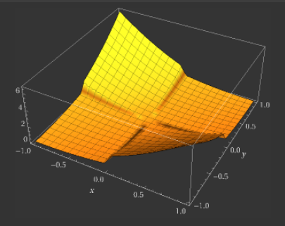
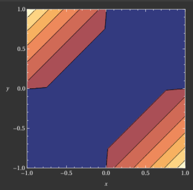
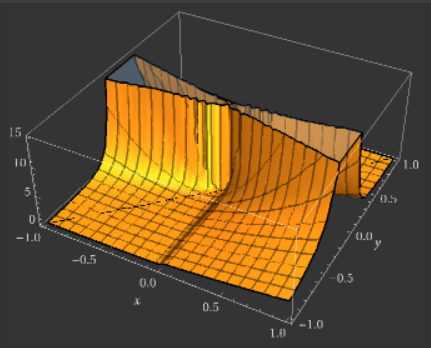
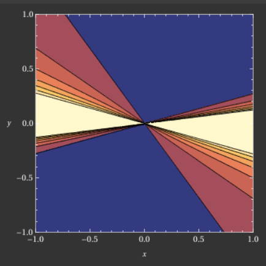

# notes for some metrics
---

1. weighted zero-mean R-squared score ${\rm R}^{2}$

$${\rm R^2} = 1 - \frac{\sum w_{i}(y_{i} - \hat{y_{i}})^{2}}{\sum w_{i}y_{i}^{2}}$$

  

---
2. action value metric, 1 to make the trade and 0 to pass on it. Each trade j has an associated weight and resp, which represents a return. For each date i, we define:
$$p_i = \sum_j(weight_{ij} * resp_{ij} * action_{ij}),
$$
$$t = \frac{\sum p_i }{\sqrt{\sum p_i^2}} * \sqrt{\frac{250}{|i|}},
$$
where $|i|$ is the number of unique dates in the test set. The utility is then defined as:
$$u = min(max(t,0), 6)  \sum p_i.$$

---
3. $$R = \text{sign}(R^2) \times \sqrt{|R^2|}$$

---
4. $$\text{RMSPE} = \sqrt{\frac{1}{n} \sum_{i=1}^{n} ((y_i - \hat{y}_i)/y_i)^2}$$

---
5. $$MAE = \frac{1}{n} \sum\limits_{i=1}^{n} {|y_i - x_i|}$$

---
6. You must predict a signed confidence value, $\hat{y}_{ti} \in [-1,1]$, which is multiplied by the market-adjusted return of a given assetCode over a ten day window. If you expect a stock to have a large positive return--compared to the broad market--over the next ten days, you might assign it a large, positive confidenceValue (near 1.0). If you expect a stock to have a negative return, you might assign it a large, negative confidenceValue (near -1.0). If unsure, you might assign it a value near zero.
For each day in the evaluation time period, we calculate:

$$x_t = \sum_i \hat{y}_{ti} r_{ti} u_{ti}$$

Score is then calculated as the mean divided by the standard deviation of your daily values:

$$\text{score} = \frac{\bar{x}_t}{\sigma(x_t)}$$

---
7. multi-class logarithmic loss

$$log loss = -\frac{1}{N}\sum_{i=1}^N\sum_{j=1}^My_{ij}\log(p_{ij}),$$

---
8. $$AdjMSELoss2 = \beta \cdot \frac{(\hat{y} - y)^2}{1 + \left[ \beta - \frac{\beta - 0.5}{1 + \exp(10000 \cdot \hat{y} \cdot y)} \right]}, \beta = 2.5$$

  

9. combine weighted zero-mean R-squared score ${\rm R}^{2}$ and AdjMSELoss2
$$\text{Adj-}R^2=1 - \frac{\sum w_i\,\beta\,\dfrac{(\hat y_i-y_i)^2}{1 + \left[ \beta - \dfrac{\beta - 0.5}{1 + \exp\!\big(10000\,\hat y_i\,y_i\big)} \right]}}{\sum w_i y_i^2 + \varepsilon}$$

  

---
10. Huber Loss
$$L_{\delta}(y, \hat{y}) = \begin{cases} \frac{1}{2}(y - \hat{y})^2 & \text{for } |y - \hat{y}| \le \delta, \\ \delta (|y - \hat{y}| - \frac{1}{2}\delta) & \text{otherwise.} \end{cases}$$

---
11. QLIKE Loss
$$QLIKE(y, \hat{y}) = \frac{y}{\hat{y}} - \ln\left(\frac{y}{\hat{y}}\right) - 1$$

---
12. Log-Loss
$$LogLoss = -\frac{1}{N}\sum_{i=1}^N \left( y_i \log(p_i) + (1-y_i) \log(1-p_i) \right)$$

---
13. Heteroskedasticity-Adjusted MSE
$$HMSE = \frac{1}{N} \sum_{i=1}^N \left( \frac{y_i}{\hat{y}_i} - 1 \right)^2$$

14. Triple Barrier style adjusted future returns
$$r_k = \frac{P_{t+k} - P_t}{P_t}$$
$$\tau = \inf \{ k \in \{1, \dots, H\} : |r_k| \ge B \}$$
$$R_H = \frac{P_{t+H} - P_t}{P_t}$$
$$Y_H = 
\begin{cases} 
\text{sgn}(r_\tau) \cdot B & \text{if } \tau \le H \text{ and } |R_H| < B \\
R_H & \text{otherwise}
\end{cases}$$